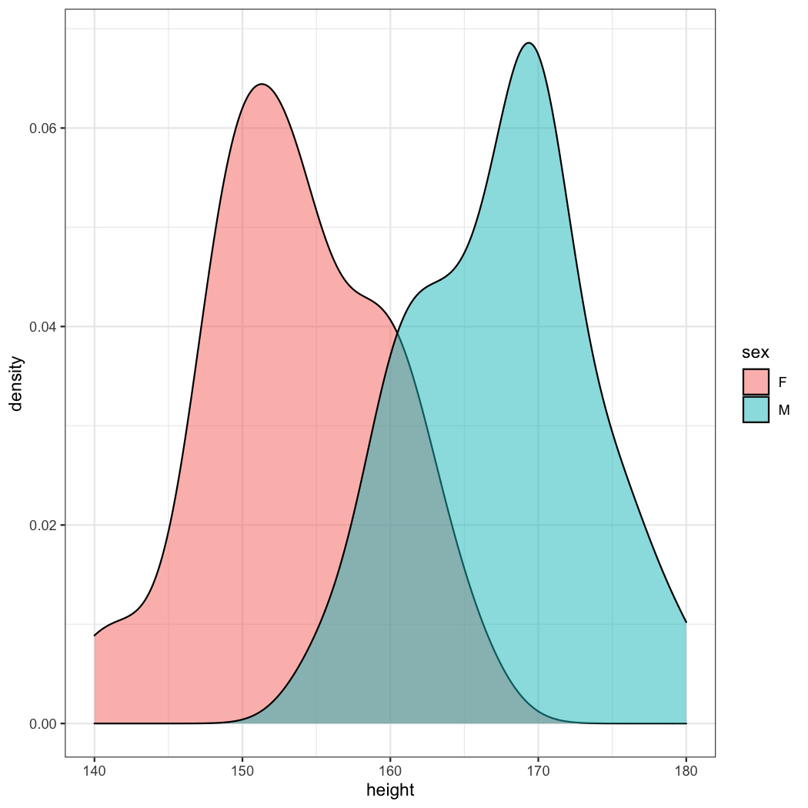
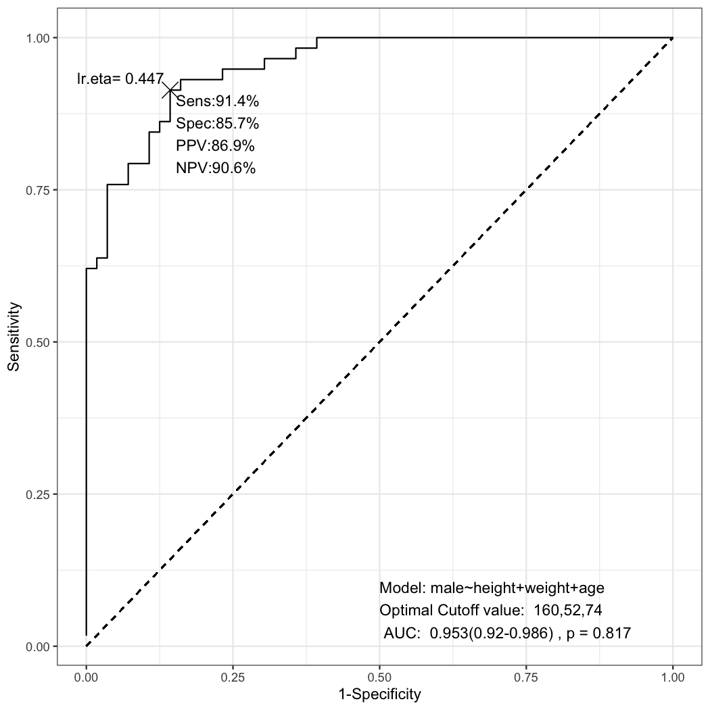

R package *multipleROC* is for ROC analysis with models with multiple predictors. You can draw a ROC plot with ggplot2 for models with multiple predictors. You can draw several ROC curves in a plot. You can perform automatic stepwise logistic regression analysis and compare the initial and final models.

## Installation

You can install multipleROC package from github.


```r
install.packages("remotes")
remotes::install_github("cardiomoon/multipleROC")
```

## Package loading


```r
library(multipleROC)
```

## Can I differentiate male patients from female patients with their height?

Data radial from package `moonBook` is a dataset containing demographic data and laboratory data of 115 patients. If you want to differentiate  male and female patients with their heights(in centimeter), you can perform exploratory analysis first.


```r
library(webr)
library(ggplot2)
library(dplyr)
library(tidyr)

theme_set(theme_bw())
data(radial,package="moonBook")
radial %>% group_by(sex) %>% numSummaryTable(height)
```

<table style='border-collapse:collapse;width:702px;'><thead><tr style="overflow-wrap:break-word;"><td style="width:54px;background-clip: padding-box;background-color:rgba(91, 119, 120, 1.00);vertical-align: middle;border-bottom: 1.00px solid rgba(237, 189, 62, 1.00);border-top: 1.00px solid rgba(0, 0, 0, 1.00);border-left: 1.00px solid rgba(0, 0, 0, 1.00);border-right: 1.00px solid rgba(0, 0, 0, 1.00);margin-bottom:0;margin-top:0;margin-left:0;margin-right:0;"><p style="margin:0;text-align:center;border-bottom: 0 solid rgba(0, 0, 0, 1.00);border-top: 0 solid rgba(0, 0, 0, 1.00);border-left: 0 solid rgba(0, 0, 0, 1.00);border-right: 0 solid rgba(0, 0, 0, 1.00);padding-bottom:2px;padding-top:2px;padding-left:5px;padding-right:5px;background-color:transparent;"><span style="font-family:'Arial';font-size:13px;font-weight:bold;font-style:normal;text-decoration:none;color:rgba(255, 255, 255, 1.00);background-color:transparent;">sex</span></p></td><td style="width:54px;background-clip: padding-box;background-color:rgba(91, 119, 120, 1.00);vertical-align: middle;border-bottom: 1.00px solid rgba(237, 189, 62, 1.00);border-top: 1.00px solid rgba(0, 0, 0, 1.00);border-left: 1.00px solid rgba(0, 0, 0, 1.00);border-right: 1.00px solid rgba(0, 0, 0, 1.00);margin-bottom:0;margin-top:0;margin-left:0;margin-right:0;"><p style="margin:0;text-align:center;border-bottom: 0 solid rgba(0, 0, 0, 1.00);border-top: 0 solid rgba(0, 0, 0, 1.00);border-left: 0 solid rgba(0, 0, 0, 1.00);border-right: 0 solid rgba(0, 0, 0, 1.00);padding-bottom:2px;padding-top:2px;padding-left:5px;padding-right:5px;background-color:transparent;"><span style="font-family:'Arial';font-size:13px;font-weight:bold;font-style:normal;text-decoration:none;color:rgba(255, 255, 255, 1.00);background-color:transparent;">n</span></p></td><td style="width:54px;background-clip: padding-box;background-color:rgba(91, 119, 120, 1.00);vertical-align: middle;border-bottom: 1.00px solid rgba(237, 189, 62, 1.00);border-top: 1.00px solid rgba(0, 0, 0, 1.00);border-left: 1.00px solid rgba(0, 0, 0, 1.00);border-right: 1.00px solid rgba(0, 0, 0, 1.00);margin-bottom:0;margin-top:0;margin-left:0;margin-right:0;"><p style="margin:0;text-align:center;border-bottom: 0 solid rgba(0, 0, 0, 1.00);border-top: 0 solid rgba(0, 0, 0, 1.00);border-left: 0 solid rgba(0, 0, 0, 1.00);border-right: 0 solid rgba(0, 0, 0, 1.00);padding-bottom:2px;padding-top:2px;padding-left:5px;padding-right:5px;background-color:transparent;"><span style="font-family:'Arial';font-size:13px;font-weight:bold;font-style:normal;text-decoration:none;color:rgba(255, 255, 255, 1.00);background-color:transparent;">mean</span></p></td><td style="width:54px;background-clip: padding-box;background-color:rgba(91, 119, 120, 1.00);vertical-align: middle;border-bottom: 1.00px solid rgba(237, 189, 62, 1.00);border-top: 1.00px solid rgba(0, 0, 0, 1.00);border-left: 1.00px solid rgba(0, 0, 0, 1.00);border-right: 1.00px solid rgba(0, 0, 0, 1.00);margin-bottom:0;margin-top:0;margin-left:0;margin-right:0;"><p style="margin:0;text-align:center;border-bottom: 0 solid rgba(0, 0, 0, 1.00);border-top: 0 solid rgba(0, 0, 0, 1.00);border-left: 0 solid rgba(0, 0, 0, 1.00);border-right: 0 solid rgba(0, 0, 0, 1.00);padding-bottom:2px;padding-top:2px;padding-left:5px;padding-right:5px;background-color:transparent;"><span style="font-family:'Arial';font-size:13px;font-weight:bold;font-style:normal;text-decoration:none;color:rgba(255, 255, 255, 1.00);background-color:transparent;">sd</span></p></td><td style="width:54px;background-clip: padding-box;background-color:rgba(91, 119, 120, 1.00);vertical-align: middle;border-bottom: 1.00px solid rgba(237, 189, 62, 1.00);border-top: 1.00px solid rgba(0, 0, 0, 1.00);border-left: 1.00px solid rgba(0, 0, 0, 1.00);border-right: 1.00px solid rgba(0, 0, 0, 1.00);margin-bottom:0;margin-top:0;margin-left:0;margin-right:0;"><p style="margin:0;text-align:center;border-bottom: 0 solid rgba(0, 0, 0, 1.00);border-top: 0 solid rgba(0, 0, 0, 1.00);border-left: 0 solid rgba(0, 0, 0, 1.00);border-right: 0 solid rgba(0, 0, 0, 1.00);padding-bottom:2px;padding-top:2px;padding-left:5px;padding-right:5px;background-color:transparent;"><span style="font-family:'Arial';font-size:13px;font-weight:bold;font-style:normal;text-decoration:none;color:rgba(255, 255, 255, 1.00);background-color:transparent;">median</span></p></td><td style="width:54px;background-clip: padding-box;background-color:rgba(91, 119, 120, 1.00);vertical-align: middle;border-bottom: 1.00px solid rgba(237, 189, 62, 1.00);border-top: 1.00px solid rgba(0, 0, 0, 1.00);border-left: 1.00px solid rgba(0, 0, 0, 1.00);border-right: 1.00px solid rgba(0, 0, 0, 1.00);margin-bottom:0;margin-top:0;margin-left:0;margin-right:0;"><p style="margin:0;text-align:center;border-bottom: 0 solid rgba(0, 0, 0, 1.00);border-top: 0 solid rgba(0, 0, 0, 1.00);border-left: 0 solid rgba(0, 0, 0, 1.00);border-right: 0 solid rgba(0, 0, 0, 1.00);padding-bottom:2px;padding-top:2px;padding-left:5px;padding-right:5px;background-color:transparent;"><span style="font-family:'Arial';font-size:13px;font-weight:bold;font-style:normal;text-decoration:none;color:rgba(255, 255, 255, 1.00);background-color:transparent;">trimmed</span></p></td><td style="width:54px;background-clip: padding-box;background-color:rgba(91, 119, 120, 1.00);vertical-align: middle;border-bottom: 1.00px solid rgba(237, 189, 62, 1.00);border-top: 1.00px solid rgba(0, 0, 0, 1.00);border-left: 1.00px solid rgba(0, 0, 0, 1.00);border-right: 1.00px solid rgba(0, 0, 0, 1.00);margin-bottom:0;margin-top:0;margin-left:0;margin-right:0;"><p style="margin:0;text-align:center;border-bottom: 0 solid rgba(0, 0, 0, 1.00);border-top: 0 solid rgba(0, 0, 0, 1.00);border-left: 0 solid rgba(0, 0, 0, 1.00);border-right: 0 solid rgba(0, 0, 0, 1.00);padding-bottom:2px;padding-top:2px;padding-left:5px;padding-right:5px;background-color:transparent;"><span style="font-family:'Arial';font-size:13px;font-weight:bold;font-style:normal;text-decoration:none;color:rgba(255, 255, 255, 1.00);background-color:transparent;">mad</span></p></td><td style="width:54px;background-clip: padding-box;background-color:rgba(91, 119, 120, 1.00);vertical-align: middle;border-bottom: 1.00px solid rgba(237, 189, 62, 1.00);border-top: 1.00px solid rgba(0, 0, 0, 1.00);border-left: 1.00px solid rgba(0, 0, 0, 1.00);border-right: 1.00px solid rgba(0, 0, 0, 1.00);margin-bottom:0;margin-top:0;margin-left:0;margin-right:0;"><p style="margin:0;text-align:center;border-bottom: 0 solid rgba(0, 0, 0, 1.00);border-top: 0 solid rgba(0, 0, 0, 1.00);border-left: 0 solid rgba(0, 0, 0, 1.00);border-right: 0 solid rgba(0, 0, 0, 1.00);padding-bottom:2px;padding-top:2px;padding-left:5px;padding-right:5px;background-color:transparent;"><span style="font-family:'Arial';font-size:13px;font-weight:bold;font-style:normal;text-decoration:none;color:rgba(255, 255, 255, 1.00);background-color:transparent;">min</span></p></td><td style="width:54px;background-clip: padding-box;background-color:rgba(91, 119, 120, 1.00);vertical-align: middle;border-bottom: 1.00px solid rgba(237, 189, 62, 1.00);border-top: 1.00px solid rgba(0, 0, 0, 1.00);border-left: 1.00px solid rgba(0, 0, 0, 1.00);border-right: 1.00px solid rgba(0, 0, 0, 1.00);margin-bottom:0;margin-top:0;margin-left:0;margin-right:0;"><p style="margin:0;text-align:center;border-bottom: 0 solid rgba(0, 0, 0, 1.00);border-top: 0 solid rgba(0, 0, 0, 1.00);border-left: 0 solid rgba(0, 0, 0, 1.00);border-right: 0 solid rgba(0, 0, 0, 1.00);padding-bottom:2px;padding-top:2px;padding-left:5px;padding-right:5px;background-color:transparent;"><span style="font-family:'Arial';font-size:13px;font-weight:bold;font-style:normal;text-decoration:none;color:rgba(255, 255, 255, 1.00);background-color:transparent;">max</span></p></td><td style="width:54px;background-clip: padding-box;background-color:rgba(91, 119, 120, 1.00);vertical-align: middle;border-bottom: 1.00px solid rgba(237, 189, 62, 1.00);border-top: 1.00px solid rgba(0, 0, 0, 1.00);border-left: 1.00px solid rgba(0, 0, 0, 1.00);border-right: 1.00px solid rgba(0, 0, 0, 1.00);margin-bottom:0;margin-top:0;margin-left:0;margin-right:0;"><p style="margin:0;text-align:center;border-bottom: 0 solid rgba(0, 0, 0, 1.00);border-top: 0 solid rgba(0, 0, 0, 1.00);border-left: 0 solid rgba(0, 0, 0, 1.00);border-right: 0 solid rgba(0, 0, 0, 1.00);padding-bottom:2px;padding-top:2px;padding-left:5px;padding-right:5px;background-color:transparent;"><span style="font-family:'Arial';font-size:13px;font-weight:bold;font-style:normal;text-decoration:none;color:rgba(255, 255, 255, 1.00);background-color:transparent;">range</span></p></td><td style="width:54px;background-clip: padding-box;background-color:rgba(91, 119, 120, 1.00);vertical-align: middle;border-bottom: 1.00px solid rgba(237, 189, 62, 1.00);border-top: 1.00px solid rgba(0, 0, 0, 1.00);border-left: 1.00px solid rgba(0, 0, 0, 1.00);border-right: 1.00px solid rgba(0, 0, 0, 1.00);margin-bottom:0;margin-top:0;margin-left:0;margin-right:0;"><p style="margin:0;text-align:center;border-bottom: 0 solid rgba(0, 0, 0, 1.00);border-top: 0 solid rgba(0, 0, 0, 1.00);border-left: 0 solid rgba(0, 0, 0, 1.00);border-right: 0 solid rgba(0, 0, 0, 1.00);padding-bottom:2px;padding-top:2px;padding-left:5px;padding-right:5px;background-color:transparent;"><span style="font-family:'Arial';font-size:13px;font-weight:bold;font-style:normal;text-decoration:none;color:rgba(255, 255, 255, 1.00);background-color:transparent;">skew</span></p></td><td style="width:54px;background-clip: padding-box;background-color:rgba(91, 119, 120, 1.00);vertical-align: middle;border-bottom: 1.00px solid rgba(237, 189, 62, 1.00);border-top: 1.00px solid rgba(0, 0, 0, 1.00);border-left: 1.00px solid rgba(0, 0, 0, 1.00);border-right: 1.00px solid rgba(0, 0, 0, 1.00);margin-bottom:0;margin-top:0;margin-left:0;margin-right:0;"><p style="margin:0;text-align:center;border-bottom: 0 solid rgba(0, 0, 0, 1.00);border-top: 0 solid rgba(0, 0, 0, 1.00);border-left: 0 solid rgba(0, 0, 0, 1.00);border-right: 0 solid rgba(0, 0, 0, 1.00);padding-bottom:2px;padding-top:2px;padding-left:5px;padding-right:5px;background-color:transparent;"><span style="font-family:'Arial';font-size:13px;font-weight:bold;font-style:normal;text-decoration:none;color:rgba(255, 255, 255, 1.00);background-color:transparent;">kurtosis</span></p></td><td style="width:54px;background-clip: padding-box;background-color:rgba(91, 119, 120, 1.00);vertical-align: middle;border-bottom: 1.00px solid rgba(237, 189, 62, 1.00);border-top: 1.00px solid rgba(0, 0, 0, 1.00);border-left: 1.00px solid rgba(0, 0, 0, 1.00);border-right: 1.00px solid rgba(0, 0, 0, 1.00);margin-bottom:0;margin-top:0;margin-left:0;margin-right:0;"><p style="margin:0;text-align:center;border-bottom: 0 solid rgba(0, 0, 0, 1.00);border-top: 0 solid rgba(0, 0, 0, 1.00);border-left: 0 solid rgba(0, 0, 0, 1.00);border-right: 0 solid rgba(0, 0, 0, 1.00);padding-bottom:2px;padding-top:2px;padding-left:5px;padding-right:5px;background-color:transparent;"><span style="font-family:'Arial';font-size:13px;font-weight:bold;font-style:normal;text-decoration:none;color:rgba(255, 255, 255, 1.00);background-color:transparent;">se</span></p></td></tr></thead><tbody><tr style="overflow-wrap:break-word;"><td style="width:54px;background-color:transparent;vertical-align: middle;border-bottom: 1.00px solid rgba(237, 189, 62, 1.00);border-top: 1.00px solid rgba(0, 0, 0, 1.00);border-left: 1.00px solid rgba(237, 189, 62, 1.00);border-right: 1.00px solid rgba(237, 189, 62, 1.00);margin-bottom:0;margin-top:0;margin-left:0;margin-right:0;"><p style="margin:0;text-align:right;border-bottom: 0 solid rgba(0, 0, 0, 1.00);border-top: 0 solid rgba(0, 0, 0, 1.00);border-left: 0 solid rgba(0, 0, 0, 1.00);border-right: 0 solid rgba(0, 0, 0, 1.00);padding-bottom:2px;padding-top:2px;padding-left:5px;padding-right:5px;background-color:transparent;"><span style="font-family:'Arial';font-size:12px;font-weight:normal;font-style:normal;text-decoration:none;color:rgba(0, 0, 0, 1.00);background-color:transparent;">F</span></p></td><td style="width:54px;background-color:transparent;vertical-align: middle;border-bottom: 1.00px solid rgba(237, 189, 62, 1.00);border-top: 1.00px solid rgba(0, 0, 0, 1.00);border-left: 1.00px solid rgba(237, 189, 62, 1.00);border-right: 1.00px solid rgba(237, 189, 62, 1.00);margin-bottom:0;margin-top:0;margin-left:0;margin-right:0;"><p style="margin:0;text-align:right;border-bottom: 0 solid rgba(0, 0, 0, 1.00);border-top: 0 solid rgba(0, 0, 0, 1.00);border-left: 0 solid rgba(0, 0, 0, 1.00);border-right: 0 solid rgba(0, 0, 0, 1.00);padding-bottom:2px;padding-top:2px;padding-left:5px;padding-right:5px;background-color:transparent;"><span style="font-family:'Arial';font-size:12px;font-weight:normal;font-style:normal;text-decoration:none;color:rgba(0, 0, 0, 1.00);background-color:transparent;">56.00</span></p></td><td style="width:54px;background-color:transparent;vertical-align: middle;border-bottom: 1.00px solid rgba(237, 189, 62, 1.00);border-top: 1.00px solid rgba(0, 0, 0, 1.00);border-left: 1.00px solid rgba(237, 189, 62, 1.00);border-right: 1.00px solid rgba(237, 189, 62, 1.00);margin-bottom:0;margin-top:0;margin-left:0;margin-right:0;"><p style="margin:0;text-align:right;border-bottom: 0 solid rgba(0, 0, 0, 1.00);border-top: 0 solid rgba(0, 0, 0, 1.00);border-left: 0 solid rgba(0, 0, 0, 1.00);border-right: 0 solid rgba(0, 0, 0, 1.00);padding-bottom:2px;padding-top:2px;padding-left:5px;padding-right:5px;background-color:transparent;"><span style="font-family:'Arial';font-size:12px;font-weight:normal;font-style:normal;text-decoration:none;color:rgba(0, 0, 0, 1.00);background-color:transparent;">153.61</span></p></td><td style="width:54px;background-color:transparent;vertical-align: middle;border-bottom: 1.00px solid rgba(237, 189, 62, 1.00);border-top: 1.00px solid rgba(0, 0, 0, 1.00);border-left: 1.00px solid rgba(237, 189, 62, 1.00);border-right: 1.00px solid rgba(237, 189, 62, 1.00);margin-bottom:0;margin-top:0;margin-left:0;margin-right:0;"><p style="margin:0;text-align:right;border-bottom: 0 solid rgba(0, 0, 0, 1.00);border-top: 0 solid rgba(0, 0, 0, 1.00);border-left: 0 solid rgba(0, 0, 0, 1.00);border-right: 0 solid rgba(0, 0, 0, 1.00);padding-bottom:2px;padding-top:2px;padding-left:5px;padding-right:5px;background-color:transparent;"><span style="font-family:'Arial';font-size:12px;font-weight:normal;font-style:normal;text-decoration:none;color:rgba(0, 0, 0, 1.00);background-color:transparent;">6.01</span></p></td><td style="width:54px;background-color:transparent;vertical-align: middle;border-bottom: 1.00px solid rgba(237, 189, 62, 1.00);border-top: 1.00px solid rgba(0, 0, 0, 1.00);border-left: 1.00px solid rgba(237, 189, 62, 1.00);border-right: 1.00px solid rgba(237, 189, 62, 1.00);margin-bottom:0;margin-top:0;margin-left:0;margin-right:0;"><p style="margin:0;text-align:right;border-bottom: 0 solid rgba(0, 0, 0, 1.00);border-top: 0 solid rgba(0, 0, 0, 1.00);border-left: 0 solid rgba(0, 0, 0, 1.00);border-right: 0 solid rgba(0, 0, 0, 1.00);padding-bottom:2px;padding-top:2px;padding-left:5px;padding-right:5px;background-color:transparent;"><span style="font-family:'Arial';font-size:12px;font-weight:normal;font-style:normal;text-decoration:none;color:rgba(0, 0, 0, 1.00);background-color:transparent;">153.00</span></p></td><td style="width:54px;background-color:transparent;vertical-align: middle;border-bottom: 1.00px solid rgba(237, 189, 62, 1.00);border-top: 1.00px solid rgba(0, 0, 0, 1.00);border-left: 1.00px solid rgba(237, 189, 62, 1.00);border-right: 1.00px solid rgba(237, 189, 62, 1.00);margin-bottom:0;margin-top:0;margin-left:0;margin-right:0;"><p style="margin:0;text-align:right;border-bottom: 0 solid rgba(0, 0, 0, 1.00);border-top: 0 solid rgba(0, 0, 0, 1.00);border-left: 0 solid rgba(0, 0, 0, 1.00);border-right: 0 solid rgba(0, 0, 0, 1.00);padding-bottom:2px;padding-top:2px;padding-left:5px;padding-right:5px;background-color:transparent;"><span style="font-family:'Arial';font-size:12px;font-weight:normal;font-style:normal;text-decoration:none;color:rgba(0, 0, 0, 1.00);background-color:transparent;">153.70</span></p></td><td style="width:54px;background-color:transparent;vertical-align: middle;border-bottom: 1.00px solid rgba(237, 189, 62, 1.00);border-top: 1.00px solid rgba(0, 0, 0, 1.00);border-left: 1.00px solid rgba(237, 189, 62, 1.00);border-right: 1.00px solid rgba(237, 189, 62, 1.00);margin-bottom:0;margin-top:0;margin-left:0;margin-right:0;"><p style="margin:0;text-align:right;border-bottom: 0 solid rgba(0, 0, 0, 1.00);border-top: 0 solid rgba(0, 0, 0, 1.00);border-left: 0 solid rgba(0, 0, 0, 1.00);border-right: 0 solid rgba(0, 0, 0, 1.00);padding-bottom:2px;padding-top:2px;padding-left:5px;padding-right:5px;background-color:transparent;"><span style="font-family:'Arial';font-size:12px;font-weight:normal;font-style:normal;text-decoration:none;color:rgba(0, 0, 0, 1.00);background-color:transparent;">5.93</span></p></td><td style="width:54px;background-color:transparent;vertical-align: middle;border-bottom: 1.00px solid rgba(237, 189, 62, 1.00);border-top: 1.00px solid rgba(0, 0, 0, 1.00);border-left: 1.00px solid rgba(237, 189, 62, 1.00);border-right: 1.00px solid rgba(237, 189, 62, 1.00);margin-bottom:0;margin-top:0;margin-left:0;margin-right:0;"><p style="margin:0;text-align:right;border-bottom: 0 solid rgba(0, 0, 0, 1.00);border-top: 0 solid rgba(0, 0, 0, 1.00);border-left: 0 solid rgba(0, 0, 0, 1.00);border-right: 0 solid rgba(0, 0, 0, 1.00);padding-bottom:2px;padding-top:2px;padding-left:5px;padding-right:5px;background-color:transparent;"><span style="font-family:'Arial';font-size:12px;font-weight:normal;font-style:normal;text-decoration:none;color:rgba(0, 0, 0, 1.00);background-color:transparent;">140.00</span></p></td><td style="width:54px;background-color:transparent;vertical-align: middle;border-bottom: 1.00px solid rgba(237, 189, 62, 1.00);border-top: 1.00px solid rgba(0, 0, 0, 1.00);border-left: 1.00px solid rgba(237, 189, 62, 1.00);border-right: 1.00px solid rgba(237, 189, 62, 1.00);margin-bottom:0;margin-top:0;margin-left:0;margin-right:0;"><p style="margin:0;text-align:right;border-bottom: 0 solid rgba(0, 0, 0, 1.00);border-top: 0 solid rgba(0, 0, 0, 1.00);border-left: 0 solid rgba(0, 0, 0, 1.00);border-right: 0 solid rgba(0, 0, 0, 1.00);padding-bottom:2px;padding-top:2px;padding-left:5px;padding-right:5px;background-color:transparent;"><span style="font-family:'Arial';font-size:12px;font-weight:normal;font-style:normal;text-decoration:none;color:rgba(0, 0, 0, 1.00);background-color:transparent;">166.00</span></p></td><td style="width:54px;background-color:transparent;vertical-align: middle;border-bottom: 1.00px solid rgba(237, 189, 62, 1.00);border-top: 1.00px solid rgba(0, 0, 0, 1.00);border-left: 1.00px solid rgba(237, 189, 62, 1.00);border-right: 1.00px solid rgba(237, 189, 62, 1.00);margin-bottom:0;margin-top:0;margin-left:0;margin-right:0;"><p style="margin:0;text-align:right;border-bottom: 0 solid rgba(0, 0, 0, 1.00);border-top: 0 solid rgba(0, 0, 0, 1.00);border-left: 0 solid rgba(0, 0, 0, 1.00);border-right: 0 solid rgba(0, 0, 0, 1.00);padding-bottom:2px;padding-top:2px;padding-left:5px;padding-right:5px;background-color:transparent;"><span style="font-family:'Arial';font-size:12px;font-weight:normal;font-style:normal;text-decoration:none;color:rgba(0, 0, 0, 1.00);background-color:transparent;">26.00</span></p></td><td style="width:54px;background-color:transparent;vertical-align: middle;border-bottom: 1.00px solid rgba(237, 189, 62, 1.00);border-top: 1.00px solid rgba(0, 0, 0, 1.00);border-left: 1.00px solid rgba(237, 189, 62, 1.00);border-right: 1.00px solid rgba(237, 189, 62, 1.00);margin-bottom:0;margin-top:0;margin-left:0;margin-right:0;"><p style="margin:0;text-align:right;border-bottom: 0 solid rgba(0, 0, 0, 1.00);border-top: 0 solid rgba(0, 0, 0, 1.00);border-left: 0 solid rgba(0, 0, 0, 1.00);border-right: 0 solid rgba(0, 0, 0, 1.00);padding-bottom:2px;padding-top:2px;padding-left:5px;padding-right:5px;background-color:transparent;"><span style="font-family:'Arial';font-size:12px;font-weight:normal;font-style:normal;text-decoration:none;color:rgba(0, 0, 0, 1.00);background-color:transparent;">-0.07</span></p></td><td style="width:54px;background-color:transparent;vertical-align: middle;border-bottom: 1.00px solid rgba(237, 189, 62, 1.00);border-top: 1.00px solid rgba(0, 0, 0, 1.00);border-left: 1.00px solid rgba(237, 189, 62, 1.00);border-right: 1.00px solid rgba(237, 189, 62, 1.00);margin-bottom:0;margin-top:0;margin-left:0;margin-right:0;"><p style="margin:0;text-align:right;border-bottom: 0 solid rgba(0, 0, 0, 1.00);border-top: 0 solid rgba(0, 0, 0, 1.00);border-left: 0 solid rgba(0, 0, 0, 1.00);border-right: 0 solid rgba(0, 0, 0, 1.00);padding-bottom:2px;padding-top:2px;padding-left:5px;padding-right:5px;background-color:transparent;"><span style="font-family:'Arial';font-size:12px;font-weight:normal;font-style:normal;text-decoration:none;color:rgba(0, 0, 0, 1.00);background-color:transparent;">-0.46</span></p></td><td style="width:54px;background-color:transparent;vertical-align: middle;border-bottom: 1.00px solid rgba(237, 189, 62, 1.00);border-top: 1.00px solid rgba(0, 0, 0, 1.00);border-left: 1.00px solid rgba(237, 189, 62, 1.00);border-right: 1.00px solid rgba(237, 189, 62, 1.00);margin-bottom:0;margin-top:0;margin-left:0;margin-right:0;"><p style="margin:0;text-align:right;border-bottom: 0 solid rgba(0, 0, 0, 1.00);border-top: 0 solid rgba(0, 0, 0, 1.00);border-left: 0 solid rgba(0, 0, 0, 1.00);border-right: 0 solid rgba(0, 0, 0, 1.00);padding-bottom:2px;padding-top:2px;padding-left:5px;padding-right:5px;background-color:transparent;"><span style="font-family:'Arial';font-size:12px;font-weight:normal;font-style:normal;text-decoration:none;color:rgba(0, 0, 0, 1.00);background-color:transparent;">0.80</span></p></td></tr><tr style="overflow-wrap:break-word;"><td style="width:54px;background-clip: padding-box;background-color:rgba(239, 239, 239, 1.00);vertical-align: middle;border-bottom: 1.00px solid rgba(237, 189, 62, 1.00);border-top: 1.00px solid rgba(237, 189, 62, 1.00);border-left: 1.00px solid rgba(237, 189, 62, 1.00);border-right: 1.00px solid rgba(237, 189, 62, 1.00);margin-bottom:0;margin-top:0;margin-left:0;margin-right:0;"><p style="margin:0;text-align:right;border-bottom: 0 solid rgba(0, 0, 0, 1.00);border-top: 0 solid rgba(0, 0, 0, 1.00);border-left: 0 solid rgba(0, 0, 0, 1.00);border-right: 0 solid rgba(0, 0, 0, 1.00);padding-bottom:2px;padding-top:2px;padding-left:5px;padding-right:5px;background-color:transparent;"><span style="font-family:'Arial';font-size:12px;font-weight:normal;font-style:normal;text-decoration:none;color:rgba(0, 0, 0, 1.00);background-color:transparent;">M</span></p></td><td style="width:54px;background-clip: padding-box;background-color:rgba(239, 239, 239, 1.00);vertical-align: middle;border-bottom: 1.00px solid rgba(237, 189, 62, 1.00);border-top: 1.00px solid rgba(237, 189, 62, 1.00);border-left: 1.00px solid rgba(237, 189, 62, 1.00);border-right: 1.00px solid rgba(237, 189, 62, 1.00);margin-bottom:0;margin-top:0;margin-left:0;margin-right:0;"><p style="margin:0;text-align:right;border-bottom: 0 solid rgba(0, 0, 0, 1.00);border-top: 0 solid rgba(0, 0, 0, 1.00);border-left: 0 solid rgba(0, 0, 0, 1.00);border-right: 0 solid rgba(0, 0, 0, 1.00);padding-bottom:2px;padding-top:2px;padding-left:5px;padding-right:5px;background-color:transparent;"><span style="font-family:'Arial';font-size:12px;font-weight:normal;font-style:normal;text-decoration:none;color:rgba(0, 0, 0, 1.00);background-color:transparent;">58.00</span></p></td><td style="width:54px;background-clip: padding-box;background-color:rgba(239, 239, 239, 1.00);vertical-align: middle;border-bottom: 1.00px solid rgba(237, 189, 62, 1.00);border-top: 1.00px solid rgba(237, 189, 62, 1.00);border-left: 1.00px solid rgba(237, 189, 62, 1.00);border-right: 1.00px solid rgba(237, 189, 62, 1.00);margin-bottom:0;margin-top:0;margin-left:0;margin-right:0;"><p style="margin:0;text-align:right;border-bottom: 0 solid rgba(0, 0, 0, 1.00);border-top: 0 solid rgba(0, 0, 0, 1.00);border-left: 0 solid rgba(0, 0, 0, 1.00);border-right: 0 solid rgba(0, 0, 0, 1.00);padding-bottom:2px;padding-top:2px;padding-left:5px;padding-right:5px;background-color:transparent;"><span style="font-family:'Arial';font-size:12px;font-weight:normal;font-style:normal;text-decoration:none;color:rgba(0, 0, 0, 1.00);background-color:transparent;">167.53</span></p></td><td style="width:54px;background-clip: padding-box;background-color:rgba(239, 239, 239, 1.00);vertical-align: middle;border-bottom: 1.00px solid rgba(237, 189, 62, 1.00);border-top: 1.00px solid rgba(237, 189, 62, 1.00);border-left: 1.00px solid rgba(237, 189, 62, 1.00);border-right: 1.00px solid rgba(237, 189, 62, 1.00);margin-bottom:0;margin-top:0;margin-left:0;margin-right:0;"><p style="margin:0;text-align:right;border-bottom: 0 solid rgba(0, 0, 0, 1.00);border-top: 0 solid rgba(0, 0, 0, 1.00);border-left: 0 solid rgba(0, 0, 0, 1.00);border-right: 0 solid rgba(0, 0, 0, 1.00);padding-bottom:2px;padding-top:2px;padding-left:5px;padding-right:5px;background-color:transparent;"><span style="font-family:'Arial';font-size:12px;font-weight:normal;font-style:normal;text-decoration:none;color:rgba(0, 0, 0, 1.00);background-color:transparent;">5.84</span></p></td><td style="width:54px;background-clip: padding-box;background-color:rgba(239, 239, 239, 1.00);vertical-align: middle;border-bottom: 1.00px solid rgba(237, 189, 62, 1.00);border-top: 1.00px solid rgba(237, 189, 62, 1.00);border-left: 1.00px solid rgba(237, 189, 62, 1.00);border-right: 1.00px solid rgba(237, 189, 62, 1.00);margin-bottom:0;margin-top:0;margin-left:0;margin-right:0;"><p style="margin:0;text-align:right;border-bottom: 0 solid rgba(0, 0, 0, 1.00);border-top: 0 solid rgba(0, 0, 0, 1.00);border-left: 0 solid rgba(0, 0, 0, 1.00);border-right: 0 solid rgba(0, 0, 0, 1.00);padding-bottom:2px;padding-top:2px;padding-left:5px;padding-right:5px;background-color:transparent;"><span style="font-family:'Arial';font-size:12px;font-weight:normal;font-style:normal;text-decoration:none;color:rgba(0, 0, 0, 1.00);background-color:transparent;">169.00</span></p></td><td style="width:54px;background-clip: padding-box;background-color:rgba(239, 239, 239, 1.00);vertical-align: middle;border-bottom: 1.00px solid rgba(237, 189, 62, 1.00);border-top: 1.00px solid rgba(237, 189, 62, 1.00);border-left: 1.00px solid rgba(237, 189, 62, 1.00);border-right: 1.00px solid rgba(237, 189, 62, 1.00);margin-bottom:0;margin-top:0;margin-left:0;margin-right:0;"><p style="margin:0;text-align:right;border-bottom: 0 solid rgba(0, 0, 0, 1.00);border-top: 0 solid rgba(0, 0, 0, 1.00);border-left: 0 solid rgba(0, 0, 0, 1.00);border-right: 0 solid rgba(0, 0, 0, 1.00);padding-bottom:2px;padding-top:2px;padding-left:5px;padding-right:5px;background-color:transparent;"><span style="font-family:'Arial';font-size:12px;font-weight:normal;font-style:normal;text-decoration:none;color:rgba(0, 0, 0, 1.00);background-color:transparent;">167.48</span></p></td><td style="width:54px;background-clip: padding-box;background-color:rgba(239, 239, 239, 1.00);vertical-align: middle;border-bottom: 1.00px solid rgba(237, 189, 62, 1.00);border-top: 1.00px solid rgba(237, 189, 62, 1.00);border-left: 1.00px solid rgba(237, 189, 62, 1.00);border-right: 1.00px solid rgba(237, 189, 62, 1.00);margin-bottom:0;margin-top:0;margin-left:0;margin-right:0;"><p style="margin:0;text-align:right;border-bottom: 0 solid rgba(0, 0, 0, 1.00);border-top: 0 solid rgba(0, 0, 0, 1.00);border-left: 0 solid rgba(0, 0, 0, 1.00);border-right: 0 solid rgba(0, 0, 0, 1.00);padding-bottom:2px;padding-top:2px;padding-left:5px;padding-right:5px;background-color:transparent;"><span style="font-family:'Arial';font-size:12px;font-weight:normal;font-style:normal;text-decoration:none;color:rgba(0, 0, 0, 1.00);background-color:transparent;">5.93</span></p></td><td style="width:54px;background-clip: padding-box;background-color:rgba(239, 239, 239, 1.00);vertical-align: middle;border-bottom: 1.00px solid rgba(237, 189, 62, 1.00);border-top: 1.00px solid rgba(237, 189, 62, 1.00);border-left: 1.00px solid rgba(237, 189, 62, 1.00);border-right: 1.00px solid rgba(237, 189, 62, 1.00);margin-bottom:0;margin-top:0;margin-left:0;margin-right:0;"><p style="margin:0;text-align:right;border-bottom: 0 solid rgba(0, 0, 0, 1.00);border-top: 0 solid rgba(0, 0, 0, 1.00);border-left: 0 solid rgba(0, 0, 0, 1.00);border-right: 0 solid rgba(0, 0, 0, 1.00);padding-bottom:2px;padding-top:2px;padding-left:5px;padding-right:5px;background-color:transparent;"><span style="font-family:'Arial';font-size:12px;font-weight:normal;font-style:normal;text-decoration:none;color:rgba(0, 0, 0, 1.00);background-color:transparent;">155.00</span></p></td><td style="width:54px;background-clip: padding-box;background-color:rgba(239, 239, 239, 1.00);vertical-align: middle;border-bottom: 1.00px solid rgba(237, 189, 62, 1.00);border-top: 1.00px solid rgba(237, 189, 62, 1.00);border-left: 1.00px solid rgba(237, 189, 62, 1.00);border-right: 1.00px solid rgba(237, 189, 62, 1.00);margin-bottom:0;margin-top:0;margin-left:0;margin-right:0;"><p style="margin:0;text-align:right;border-bottom: 0 solid rgba(0, 0, 0, 1.00);border-top: 0 solid rgba(0, 0, 0, 1.00);border-left: 0 solid rgba(0, 0, 0, 1.00);border-right: 0 solid rgba(0, 0, 0, 1.00);padding-bottom:2px;padding-top:2px;padding-left:5px;padding-right:5px;background-color:transparent;"><span style="font-family:'Arial';font-size:12px;font-weight:normal;font-style:normal;text-decoration:none;color:rgba(0, 0, 0, 1.00);background-color:transparent;">180.00</span></p></td><td style="width:54px;background-clip: padding-box;background-color:rgba(239, 239, 239, 1.00);vertical-align: middle;border-bottom: 1.00px solid rgba(237, 189, 62, 1.00);border-top: 1.00px solid rgba(237, 189, 62, 1.00);border-left: 1.00px solid rgba(237, 189, 62, 1.00);border-right: 1.00px solid rgba(237, 189, 62, 1.00);margin-bottom:0;margin-top:0;margin-left:0;margin-right:0;"><p style="margin:0;text-align:right;border-bottom: 0 solid rgba(0, 0, 0, 1.00);border-top: 0 solid rgba(0, 0, 0, 1.00);border-left: 0 solid rgba(0, 0, 0, 1.00);border-right: 0 solid rgba(0, 0, 0, 1.00);padding-bottom:2px;padding-top:2px;padding-left:5px;padding-right:5px;background-color:transparent;"><span style="font-family:'Arial';font-size:12px;font-weight:normal;font-style:normal;text-decoration:none;color:rgba(0, 0, 0, 1.00);background-color:transparent;">25.00</span></p></td><td style="width:54px;background-clip: padding-box;background-color:rgba(239, 239, 239, 1.00);vertical-align: middle;border-bottom: 1.00px solid rgba(237, 189, 62, 1.00);border-top: 1.00px solid rgba(237, 189, 62, 1.00);border-left: 1.00px solid rgba(237, 189, 62, 1.00);border-right: 1.00px solid rgba(237, 189, 62, 1.00);margin-bottom:0;margin-top:0;margin-left:0;margin-right:0;"><p style="margin:0;text-align:right;border-bottom: 0 solid rgba(0, 0, 0, 1.00);border-top: 0 solid rgba(0, 0, 0, 1.00);border-left: 0 solid rgba(0, 0, 0, 1.00);border-right: 0 solid rgba(0, 0, 0, 1.00);padding-bottom:2px;padding-top:2px;padding-left:5px;padding-right:5px;background-color:transparent;"><span style="font-family:'Arial';font-size:12px;font-weight:normal;font-style:normal;text-decoration:none;color:rgba(0, 0, 0, 1.00);background-color:transparent;">-0.01</span></p></td><td style="width:54px;background-clip: padding-box;background-color:rgba(239, 239, 239, 1.00);vertical-align: middle;border-bottom: 1.00px solid rgba(237, 189, 62, 1.00);border-top: 1.00px solid rgba(237, 189, 62, 1.00);border-left: 1.00px solid rgba(237, 189, 62, 1.00);border-right: 1.00px solid rgba(237, 189, 62, 1.00);margin-bottom:0;margin-top:0;margin-left:0;margin-right:0;"><p style="margin:0;text-align:right;border-bottom: 0 solid rgba(0, 0, 0, 1.00);border-top: 0 solid rgba(0, 0, 0, 1.00);border-left: 0 solid rgba(0, 0, 0, 1.00);border-right: 0 solid rgba(0, 0, 0, 1.00);padding-bottom:2px;padding-top:2px;padding-left:5px;padding-right:5px;background-color:transparent;"><span style="font-family:'Arial';font-size:12px;font-weight:normal;font-style:normal;text-decoration:none;color:rgba(0, 0, 0, 1.00);background-color:transparent;">-0.60</span></p></td><td style="width:54px;background-clip: padding-box;background-color:rgba(239, 239, 239, 1.00);vertical-align: middle;border-bottom: 1.00px solid rgba(237, 189, 62, 1.00);border-top: 1.00px solid rgba(237, 189, 62, 1.00);border-left: 1.00px solid rgba(237, 189, 62, 1.00);border-right: 1.00px solid rgba(237, 189, 62, 1.00);margin-bottom:0;margin-top:0;margin-left:0;margin-right:0;"><p style="margin:0;text-align:right;border-bottom: 0 solid rgba(0, 0, 0, 1.00);border-top: 0 solid rgba(0, 0, 0, 1.00);border-left: 0 solid rgba(0, 0, 0, 1.00);border-right: 0 solid rgba(0, 0, 0, 1.00);padding-bottom:2px;padding-top:2px;padding-left:5px;padding-right:5px;background-color:transparent;"><span style="font-family:'Arial';font-size:12px;font-weight:normal;font-style:normal;text-decoration:none;color:rgba(0, 0, 0, 1.00);background-color:transparent;">0.77</span></p></td></tr></tbody></table>
You can draw exploratory plots.

```r
ggplot(data=radial)+geom_density(aes(x=height,fill=sex),alpha=0.5) 
ggplot(data=radial)+geom_boxplot(aes(x=sex,y=height,fill=sex),alpha=0.5) 
```


As you can see, male patients are taller than female patients. But how can I determine  the optimal cutoff value?


## Make the first ROC plot

To draw a ROC curve is one of the useful method to determine the optimal cutoff value. You can perform ROC analysis using the following R command.The following R command makes an object of class `multipleROC` and makes a plot.  


```r
data(radial,package="moonBook")
x=multipleROC(male~height,data=radial)
```


### Sensitivity, Specificity, PPV and NPV

You can see the ROC plot with sensitivity(Sens), specificity(Spec), positive predictive value(PPV) and negative predictive value(NPV) with the cutoff value 161. These rates comes from the following table.


```r
table(radial$height>=161,radial$male)
       
         0  1
  FALSE 49  8
  TRUE   7 50
```
If you use the height $\geq$ 161cm to differentiate male patients from female patients, the true positive(TP) is 50(out of 114), true negative(TN) is 49, false positive(FP) is 7 and the false negative(FN) is 8 patients. You can calculate sensitivity, specificity, positive predictive value and negative predictive values by manual. Sensitivity measures how often a test correctly generates a positive result for people who have the condition that’s being tested for (also known as the “true positive” rate). 

\begin{equation}
Sensitivity=\frac{TP}{Male\, Patients}=\frac{TP}{FN+TP}=\frac{50}{8+50}=86.2 \%
\end{equation}

Specificity measures a test’s ability to correctly generate a negative result for people who don’t have the condition that’s being tested for (also known as the “true negative” rate).

\begin{equation}
Specificity=\frac{TN}{Female\, Patients}=\frac{TN}{TN+FP}=\frac{49}{49+7}=87.5 \%
\end{equation}

Positive predictive value(PPV) is calculated as follows:

\begin{equation}
PPV=\frac{TP}{Pts\,with\, height \geq 161cm}=\frac{TP}{TP+FP}=\frac{50}{50+7}=87.7\%
\end{equation}

Negative predictive value(PPV) is calculated as follows:

\begin{equation}
NPV=\frac{TN}{Pts\,with\, height < 161cm}=\frac{TN}{TN+FN}=\frac{49}{49+8}= 85.9 \%
\end{equation}

### The optimal cutoff value

You can calculate the sensitivity, specificity for all the height data of radial. The radial data are from 115 patients, but 1 patient's height is missed. But the length of unique values of radial$height is 39 due to duplication. 

```r
length(unique(radial$height))
[1] 39
```
You can calculate all the ratio by hand. For your convenience, you can use calSens() function included in multipleROC package. 


```r
calSens=function(x,y){
     newx=sort(unique(x))
     completeTable=function(res){
          if(nrow(res)==1){
               res1=matrix(c(0,0),nrow=1)
               temp=setdiff(c("TRUE","FALSE"),attr(res,"dimnames")[[1]][1])
               if(temp=="FALSE") res=rbind(res1,res)
               else res=rbind(res,res1)
               res
          }
          res
     }

     getSens=function(cut){
          res=table(x>=cut,y)
          res=completeTable(res)
          sens=res[2,2]/sum(res[,2])
          spec=res[1,1]/sum(res[,1])
          ppv=res[2,2]/sum(res[2,])
          npv=res[1,1]/sum(res[1,])
          data.frame(x=cut,sens=sens,spec=spec,fpr=1-spec,ppv=ppv,npv=npv,sum=sens+spec)
     }
     map_dfr(newx,function(cut){getSens(cut)})
}
```


```r
result=calSens(radial$height,radial$male)
result
       x       sens       spec        fpr       ppv       npv      sum
1  140.0 1.00000000 0.00000000 1.00000000 0.5087719       NaN 1.000000
2  142.0 1.00000000 0.03571429 0.96428571 0.5178571 1.0000000 1.035714
3  144.0 1.00000000 0.05357143 0.94642857 0.5225225 1.0000000 1.053571
4  147.0 1.00000000 0.07142857 0.92857143 0.5272727 1.0000000 1.071429
5  147.5 1.00000000 0.08928571 0.91071429 0.5321101 1.0000000 1.089286
6  148.0 1.00000000 0.10714286 0.89285714 0.5370370 1.0000000 1.107143
7  149.0 1.00000000 0.17857143 0.82142857 0.5576923 1.0000000 1.178571
8  149.4 1.00000000 0.23214286 0.76785714 0.5742574 1.0000000 1.232143
9  150.0 1.00000000 0.25000000 0.75000000 0.5800000 1.0000000 1.250000
10 151.0 1.00000000 0.35714286 0.64285714 0.6170213 1.0000000 1.357143
11 152.0 1.00000000 0.37500000 0.62500000 0.6236559 1.0000000 1.375000
12 153.0 1.00000000 0.42857143 0.57142857 0.6444444 1.0000000 1.428571
13 154.0 1.00000000 0.55357143 0.44642857 0.6987952 1.0000000 1.553571
14 155.0 1.00000000 0.60714286 0.39285714 0.7250000 1.0000000 1.607143
15 155.5 0.98275862 0.62500000 0.37500000 0.7307692 0.9722222 1.607759
16 156.0 0.98275862 0.64285714 0.35714286 0.7402597 0.9729730 1.625616
17 157.0 0.96551724 0.67857143 0.32142857 0.7567568 0.9500000 1.644089
18 158.0 0.96551724 0.69642857 0.30357143 0.7671233 0.9512195 1.661946
19 159.0 0.94827586 0.76785714 0.23214286 0.8088235 0.9347826 1.716133
20 160.0 0.93103448 0.76785714 0.23214286 0.8059701 0.9148936 1.698892
21 161.0 0.86206897 0.87500000 0.12500000 0.8771930 0.8596491 1.737069
22 162.0 0.79310345 0.89285714 0.10714286 0.8846154 0.8064516 1.685961
23 163.0 0.77586207 0.92857143 0.07142857 0.9183673 0.8000000 1.704433
24 164.0 0.72413793 0.96428571 0.03571429 0.9545455 0.7714286 1.688424
25 165.0 0.68965517 0.96428571 0.03571429 0.9523810 0.7500000 1.653941
26 166.0 0.62068966 0.98214286 0.01785714 0.9729730 0.7142857 1.602833
27 167.0 0.60344828 1.00000000 0.00000000 1.0000000 0.7088608 1.603448
28 168.0 0.55172414 1.00000000 0.00000000 1.0000000 0.6829268 1.551724
29 169.0 0.51724138 1.00000000 0.00000000 1.0000000 0.6666667 1.517241
30 170.0 0.39655172 1.00000000 0.00000000 1.0000000 0.6153846 1.396552
31 171.0 0.25862069 1.00000000 0.00000000 1.0000000 0.5656566 1.258621
32 172.0 0.22413793 1.00000000 0.00000000 1.0000000 0.5544554 1.224138
33 173.0 0.17241379 1.00000000 0.00000000 1.0000000 0.5384615 1.172414
34 174.0 0.15517241 1.00000000 0.00000000 1.0000000 0.5333333 1.155172
35 175.0 0.13793103 1.00000000 0.00000000 1.0000000 0.5283019 1.137931
36 176.0 0.08620690 1.00000000 0.00000000 1.0000000 0.5137615 1.086207
37 177.0 0.06896552 1.00000000 0.00000000 1.0000000 0.5090909 1.068966
38 180.0 0.03448276 1.00000000 0.00000000 1.0000000 0.5000000 1.034483
```


You can make exploratory plot of sensitivity and specificity. First, You have to transform the data in long from.

```r
longdf <- result %>% pivot_longer(cols=sens:spec,names_to = "rate")
ggplot(data=longdf,aes(x=x,y=value,color=rate))+geom_line()
```


As you can see, the higher the sensitivity, the lower the specificity. The optimal cutoff value is determined where the sum of specificity and sensitivity is the highest.


```r
result[which.max(result$sum),]
     x     sens  spec   fpr      ppv       npv      sum
21 161 0.862069 0.875 0.125 0.877193 0.8596491 1.737069
```
You can see when the height is 161cm, the sum of sensitivity and specificity is the highest. So the best cutoff value of height is 161cm. With the result, you can draw the ROC plot.


```r
result=result[order(result$sens),]
ggplot(data=result,aes(x=fpr,y=sens))+geom_line()
```


### The optimal value obtained by generalized linear model

Look at the first ROC plot again. In the ROC plot, you can see the cutoff value of lr.eta is 0.545. Where does this value come from? This value comes from the generalized linear model.


```r
fit=glm(male~height,data=radial,family=binomial)
fit$fitted.values
           1            2            3            4            5            6            7            8 
0.0647799156 0.0089609908 0.5450612249 0.1902888834 0.7301078853 0.0134046841 0.8593140964 0.2609731323 
           9           10           11           12           13           14           15           16 
0.9688855513 0.1131501263 0.8593140964 0.9972179420 0.0134046841 0.0059814642 0.9790755722 0.6428952491 
          17           18           19           20           21           22           23           24 
0.9688855513 0.0089609908 0.9790755722 0.0059814642 0.0440658619 0.0039886420 0.9539663976 0.9859766507 
          25           26           27           28           29           30           31           32 
0.0134046841 0.8593140964 0.4436202683 0.9906234843 0.9906234843 0.8593140964 0.9688855513 0.5450612249 
          33           34           35           36           37           38           39           40 
0.9688855513 0.4436202683 0.9987659427 0.0440658619 0.9972179420 0.0059814642 0.5450612249 0.4436202683 
          41           42           43           44           45           46           47           48 
0.4436202683 0.0440658619 0.3466721723 0.5450612249 0.4436202683 0.9323927854 0.0297645408 0.0297645408 
          49           50           51           52           53           54           55           56 
0.9790755722 0.9790755722 0.7301078853 0.9688855513 0.7301078853 0.9937403001 0.9790755722 0.0011789400 
          57           58           59           60           61           62           63           64 
0.1352457877 0.9539663976 0.7301078853 0.0059814642 0.7301078853 0.0134046841 0.9996359536 0.9790755722 
          65           66           67           68           69           70           71           72 
0.6428952491 0.4436202683 0.1352457877 0.0942707968 0.0647799156 0.5450612249 0.9906234843 0.9017500029 
          73           74           75           76           77           78           79           80 
0.9859766507 0.2609731323 0.9981468171 0.4436202683 0.6428952491 0.9996359536 0.0005224834 0.2609731323 
          81           82           83           84           85           86           87           88 
0.4436202683 0.9688855513 0.4436202683 0.9017500029 0.0440658619 0.8593140964 0.9323927854 0.0002314699 
          89           90           91           92           93           94           95           96 
0.9972179420 0.0297645408 0.8025624552 0.9958254317 0.0647799156 0.9790755722 0.0089609908 0.0048849508 
          97           98           99          100          102          103          104          105 
0.0105295308 0.0134046841 0.0440658619 0.9688855513 0.0942707968 0.0200074872 0.0440658619 0.8025624552 
         106          107          108          109          110          111          112          113 
0.9790755722 0.4436202683 0.9987659427 0.0440658619 0.0134046841 0.0002314699 0.1352457877 0.2609731323 
         114          115 
0.2609731323 0.9323927854 
```

You can see the fitted mean values, obtained by transforming the linear predictors by the inverse of the link function. You can use this value to make a ROC plot. Again, you can use calSens() function.


```r
result2=calSens(fit$fitted.values,fit$y)
result2[which.max(result2$sum),]
           x     sens  spec   fpr      ppv       npv      sum
21 0.5450612 0.862069 0.875 0.125 0.877193 0.8596491 1.737069
```

The optimal fitted value is 0.5451. You can draw ROC curve with this value.


```r
result2=result2[order(result2$sens),]
ggplot(data=result2,aes(x=fpr,y=sens))+geom_line()
```


What is the relationship of the fitted value of 0.5451 and height 161cm ? 
As you knows, you can interpretate the logistic equation as follows.

\begin{equation}
 log(\frac{p}{1-p})=\beta_0+\beta_1*X
\end{equation}

This equation is expressed with the following R command.

```
qlogis(x$cutpoint)=coef(x$fit)[1]+coef(x$fit)[2]*X
```

So you can calculate the optimal cutpoint of height with the optimal fitted value 0.5451 as follows.


```r
height=(qlogis(x$cutpoint)-unname(coef(x$fit)[1]))/unname(coef(x$fit)[2])
height
[1] 161
```


### Area under curve(AUC)

In the lower right corner, you can see the area under curve(AUC) and the p value from Wilcoxon Rank Sum test. The p value comes from:


```r
wilcox.test(radial$height,radial$male)

	Wilcoxon rank sum test with continuity correction

data:  radial$height and radial$male
W = 13110, p-value < 2.2e-16
alternative hypothesis: true location shift is not equal to 0
```

The AUC is calcuated by the simpleAUC function included in multipleROC package.

```r
simpleAUC <- function(df){
     df=df[order(df$x,decreasing=TRUE),]
     TPR=df$sens
     FPR=df$fpr

     dFPR <- c(diff(FPR), 0)
     dTPR <- c(diff(TPR), 0)

     sum(TPR * dFPR) + sum(dTPR * dFPR)/2
}

simpleAUC(x$df)
[1] 0.9510468
```

### Convert to pROC::roc object

You can convert a multipleROC object to a roc object. You can use this object to calculate auc or compare the AUC of two ROC curves.

```r
class(x)
[1] "multipleROC"
multipleROC2roc=function(x){
     pROC::roc(x$fit$y,x$fit$fitted.values,ci=T)
}

x2 <- multipleROC2roc(x)
class(x2)
[1] "roc"
pROC::auc(x2)
Area under the curve: 0.951
```


## Multiple ROC curves

You can draw multiple ROC curves in the same plot. First, make a list of multipleROC objects and use the plot_ROC function.


```r
a=multipleROC(male~height,data=radial,plot=FALSE)
b=multipleROC(male~age,data=radial,plot=FALSE)
c=multipleROC(form=male~weight,data=radial,plot=FALSE)
plot_ROC(list(a,b,c),show.eta=FALSE,show.sens=FALSE)
```


You can make facetted plot with the following R command.


```r
plot_ROC(list(a,b,c),facet=TRUE)
```


By setting the facet argument TRUE, you can get the facetted plot. Alternatively you can use the facet_grid() function of the package ggplot2.


```r
require(ggplot2)
plot_ROC(list(a,b,c))+facet_grid(no~.)
```


## Models with multiple predictors

You can make ROC plots with multiple predictors. 


```r
multipleROC(male~height+weight+age,data=radial)
```



This plot is made from the following `glm` object.


```r
fit=glm(male~height+weight+age,data=radial,family=binomial)
```

## Automatic stepwise backward elmination and final model selection

You can use automatic stepwise backward elmination by AIC in multiple glm model.


```r
final=step(fit,trace=0)
summary(final)

Call:
glm(formula = male ~ height, family = binomial, data = radial)

Deviance Residuals: 
     Min        1Q    Median        3Q       Max  
-2.15418  -0.30022   0.02699   0.25143   2.17328  

Coefficients:
             Estimate Std. Error z value Pr(>|z|)    
(Intercept) -65.38126   12.72530  -5.138 2.78e-07 ***
height        0.40722    0.07918   5.143 2.71e-07 ***
---
Signif. codes:  0 '***' 0.001 '**' 0.01 '*' 0.05 '.' 0.1 ' ' 1

(Dispersion parameter for binomial family taken to be 1)

    Null deviance: 158.002  on 113  degrees of freedom
Residual deviance:  63.462  on 112  degrees of freedom
  (1 observation deleted due to missingness)
AIC: 67.462

Number of Fisher Scoring iterations: 6
```

You can compare the initial and final model.


```r
anova(final,fit,test="Chisq")
Analysis of Deviance Table

Model 1: male ~ height
Model 2: male ~ height + weight + age
  Resid. Df Resid. Dev Df Deviance Pr(>Chi)
1       112     63.462                     
2       110     63.352  2  0.11025   0.9464
```

You can draw plot comparing two ROC curves of the inital and the final model.


```r
step_ROC(male~weight+height+age,data=radial)
```


You can get the anova table.

```r
step_ROC(male~weight+height+age,data=radial,plot=FALSE)
Analysis of Deviance Table

Model 1: male ~ height
Model 2: male ~ weight + height + age
  Resid. Df Resid. Dev Df Deviance Pr(>Chi)
1       112     63.462                     
2       110     63.352  2  0.11025   0.9464
```


